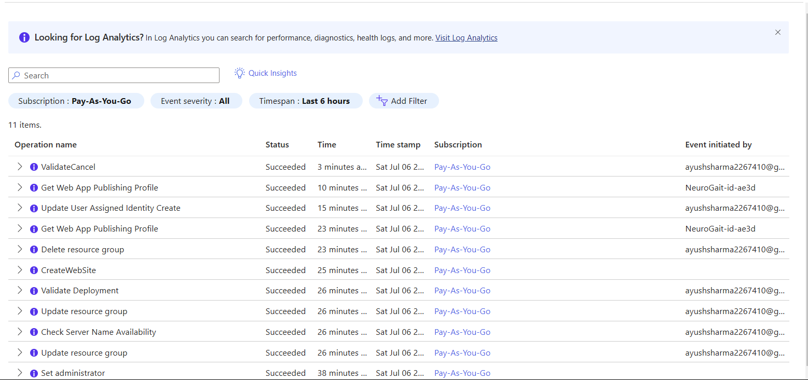
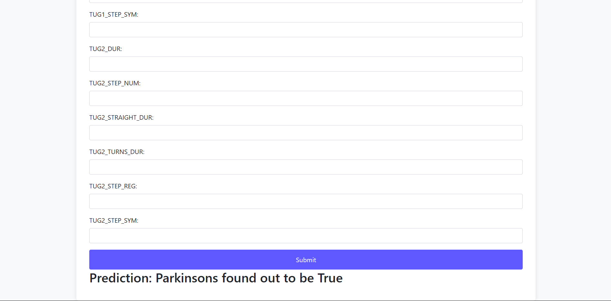

<p align="center">


</p>

## 💥 Introduction
Parkinson's Detection is an advanced machine learning project aimed at predicting Parkinson's Disease using a unique dataset with 56 parameters from the University of California. The project employs Convolutional Neural Networks (CNN) for feature extraction and leverages XGBoost, Random Forest, and CatBoost to find the best model for accurate predictions.

## 💡 Why did I build this?
Parkinson's Disease is a progressive neurological disorder that affects millions of people worldwide. Early detection can significantly improve the quality of life for patients. Motivated by the challenge and the potential impact on healthcare, I developed this project to leverage state-of-the-art machine learning techniques for early detection of Parkinson's Disease using an unexplored dataset based on gait analysis.

## 📊 Dataset
Check about the dataset in detail here : [ Gait Analysis](https://drive.google.com/file/d/1UDixzxS4d6W5YWs54aNLrlVYNePHZ7uN/view?usp=sharing)

The dataset used in this project is unique and comprehensive, consisting of 56 parameters related to various biomarkers and clinical features associated with Parkinson's Disease. The gait system includes three lightweight wireless wearable sensors with three axial accelerometers, gyroscopes, and magnetometers. These sensors measure acceleration in three orthogonal axes as a function of time and are worn on both wrists and the lower back of participants during gait measurements. The assessment includes six tests:

● Sway 30 sec eyes open: Center of mass displacement during usual condition.

● Sway 30 sec eyes closed: Center of mass displacement during challenging condition.

● Timed Up and Go (TUG) 1: Assessment of mobility, transfers, and turns.

● TUG 2: Repeated task.

● Usual walk 1 minute: Preferred walking speed.

● Dual task walk 1 minute: Walk while simultaneously subtracting 3’s from a predefined number.

## Gait Features

Sway: Path, velocity, centroidal frequency, jerk.
Timed Up and Go (TUG): Duration, number of steps, step duration, step regularity, step symmetry.
Walking: Speed, number of steps, cadence, average stride time, stride variability, step regularity, step symmetry, jerk.
Arm Swing: Amplitude, variability, jerk, asymmetry index.
Trunk Rotation: Amplitude, asymmetry, jerk

## 🛠️ Local development
To get started with local development, ensure that you have <b>Git</b>, <b>Python</b>, and <b>Flask</b> installed.

Start by cloning the repository:

```sh
git clone https://github.com/yourusername/ParkinsonsDetection.git
```

```sh
cd ParkinsonsDetection
```
Create a virtual environment and activate it:
```sh
python3 -m venv venv
```
```sh
venv\Scripts\activate
```
Install the required dependencies:

```sh
pip install -r requirements.txt
```
Run the application:

```sh
python application.py

```

The application will be accessible at http://127.0.0.1:5000.

## 🥁 Features
● Advanced Machine Learning Models: Utilizes CNN for feature extraction and XGBoost, Random Forest, and CatBoost for prediction.

● Comprehensive Dataset: Employs a unique dataset with 56 parameters for accurate prediction.

● User-Friendly Interface: Easy to use web application for data input and prediction results.

## Note 📝
The Azure instance has been temporarily deleted due to billing issues. However, the deployment process and configuration are documented below.

### Azure Deployment Screenshots

Azure Dashboard showing the deployed service.



Configuration settings of the Azure service.

### How to Redeploy 🔄
If you wish to redeploy the project, follow these steps:

1. Clone the Repository: Ensure you have the project code.
```sh
git clone https://github.com/yourusername/parkinsons-detection.git
```
2. Create and Configure Azure Resources: Follow the deployment steps mentioned above to set up the Azure resources.
3. Deploy Using GitHub Actions: Configure GitHub Actions for continuous deployment from your repository to Azure.

## 📜 LICENSE
AGPL 3.0 License

